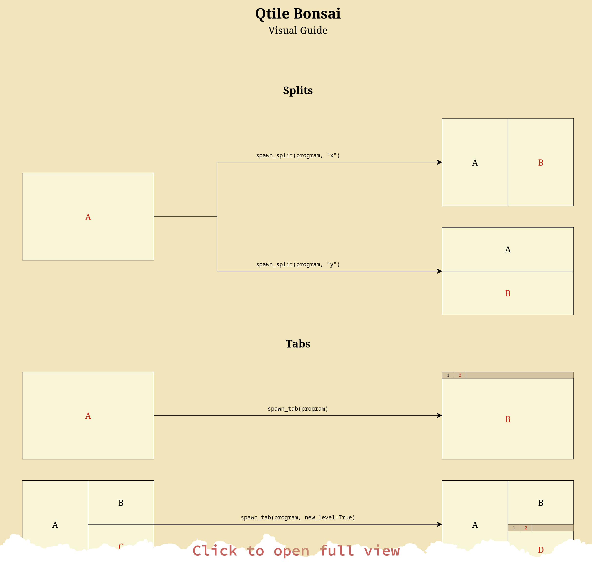

<!-- 
README.md is a generated file! 

To make modifications, make sure you're editing `templates/README.template.md`.
Then generate the README with `python scripts/generate_readme.py`
-->


<h1 align="center">
  Qtile Bonsai
</h1>

<p align="center">
  <a href="https://github.com/aravinda0/qtile-bonsai/actions?query=branch%3Amaster"></a>
  <a href="https://codecov.io/gh/aravinda0/qtile-bonsai"></a>
  <a href="https://github.com/aravinda0/qtile-bonsai/blob/master/LICENSE.txt"></a>
</p>
<p align="center">
  <a href="https://aravinda0.github.io/qtile-bonsai/static/visual_guide/"></a>
  <a href="#reference"></a>
</p>

<br/>

## Introduction

_Qtile Bonsai_ provides a flexible layout for the
[qtile](https://github.com/qtile/qtile) tiling window manager that allows you to
arrange windows as tabs, splits and even subtabs inside splits. 

You also get an API for quick-access and rearrangements of your tabs and windows.

Check out the demo below, or the [visual guide](#visual-guide) further below.

<br>

<!-- GitHub will simply render this into a video it seems. Generated by dragging
and dropping into GitHub README editor GUI -->
https://github.com/aravinda0/qtile-bonsai/assets/960763/b74e559a-30c0-4de7-86f4-ecea8e68125c


<br/>

## Getting Started

### Installation

Assuming you already have
[qtile up and running](https://docs.qtile.org/en/latest/manual/install/), you
have the following options for installation.

#### PyPI

```bash
pip install qtile-bonsai 
```

> [!NOTE]
> If you have qtile installed globally (eg. via your distro's package manager),
> you likely have to do:
> 
> ```bash
> pip install qtile-bonsai --break-system-packages
> ```
> 
> Nowadays `pip` tries to play it safe and not potentially modify some
> dependency that your system's Python-software may depend on. For qtile-bonsai,
> using this flag should be safe.
> 
> An alternative approach would be to have installed qtile via [pipx](https://github.com/pypa/pipx) 
> and then 'inject' qtile-bonsai into the same virtualenv where qtile resides:
> 
> ```
> pipx install qtile
> pipx inject qtile qtile-bonsai
> ```

#### AUR

For arch-based distros, you can install it from the AUR either manually or with
your favorite AUR-helper. For example:

```
yay -S qtile-bonsai
```

#### NixOS

It is available in [nixpgks](https://search.nixos.org/packages?channel=unstable&from=0&size=50&sort=relevance&type=packages&query=qtile-bonsai) as `qtile-bonsai`:

```nix
{
  services.xserver.windowManager.qtile = {
    enable = true;
    extraPackages = python3Packages: with python3Packages; [
      qtile-bonsai
    ];
  };
}
```

### Configuration

#### 1. Make Bonsai available as a layout in your [qtile config](https://docs.qtile.org/en/latest/manual/config/default.html)

```python
from qtile_bonsai import Bonsai


layouts = [
    Bonsai(**{
      # Specify your options here. These examples are defaults.
      "window.border_size": 1,
      "tab_bar.height": 20,
      
      # You can specify subtab level specific options if desired by prefixing
      # the option key with the appropriate level, eg. L1, L2, L3 etc.
      # For example, the following options affect only 2nd level subtabs and
      # their windows:
      # "L2.window.border_color": "#ff0000",
      # "L2.window.margin": 5,
    }),
]
```

#### 2. Add your personal keybindings to your qtile config

```python
from libqtile.config import EzKey, KeyChord
from libqtile.lazy import lazy
from libqtile.utils import guess_terminal


terminal = guess_terminal()
rofi_run_cmd = "rofi -show drun -m -1"

keys = [
    # Open your terminal emulator quickly. See further below for how to
    # directly open other apps as splits/tabs using something like rofi.
    EzKey("M-v", lazy.layout.spawn_split(terminal, "x")),
    EzKey("M-x", lazy.layout.spawn_split(terminal, "y")),
    EzKey("M-t", lazy.layout.spawn_tab(terminal)),
    EzKey("M-S-t", lazy.layout.spawn_tab(terminal, new_level=True)),
    
    # Sometimes it's handy to have a split open in the 'previous' position
    EzKey("M-S-v", lazy.layout.spawn_split(terminal, "x", position="previous")),
    EzKey("M-S-x", lazy.layout.spawn_split(terminal, "y", position="previous")),

    # Motions to move focus. The names are compatible with built-in layouts.
    EzKey("M-h", lazy.layout.left()),
    EzKey("M-l", lazy.layout.right()),
    EzKey("M-k", lazy.layout.up()),
    EzKey("M-j", lazy.layout.down()),
    EzKey("M-d", lazy.layout.prev_tab()),
    EzKey("M-f", lazy.layout.next_tab()),
    
    # Precise motions to move directly to specific tabs at the nearest tab level
    EzKey("M-1", lazy.layout.focus_nth_tab(1, level=-1)),
    EzKey("M-2", lazy.layout.focus_nth_tab(2, level=-1)),
    EzKey("M-3", lazy.layout.focus_nth_tab(3, level=-1)),
    EzKey("M-4", lazy.layout.focus_nth_tab(4, level=-1)),
    EzKey("M-5", lazy.layout.focus_nth_tab(5, level=-1)),
    
    # Precise motions to move to specific windows. The options provided here let
    # us pick the nth window counting only from under currently active [sub]tabs
    EzKey("C-1", lazy.layout.focus_nth_window(1, ignore_inactive_tabs_at_levels=[1,2])),
    EzKey("C-2", lazy.layout.focus_nth_window(2, ignore_inactive_tabs_at_levels=[1,2])),
    EzKey("C-3", lazy.layout.focus_nth_window(3, ignore_inactive_tabs_at_levels=[1,2])),
    EzKey("C-4", lazy.layout.focus_nth_window(4, ignore_inactive_tabs_at_levels=[1,2])),
    EzKey("C-5", lazy.layout.focus_nth_window(5, ignore_inactive_tabs_at_levels=[1,2])),

    # Resize operations
    EzKey("M-C-h", lazy.layout.resize("left", 100)),
    EzKey("M-C-l", lazy.layout.resize("right", 100)),
    EzKey("M-C-k", lazy.layout.resize("up", 100)),
    EzKey("M-C-j", lazy.layout.resize("down", 100)),

    # Swap windows/tabs with neighbors
    EzKey("M-S-h", lazy.layout.swap("left")),
    EzKey("M-S-l", lazy.layout.swap("right")),
    EzKey("M-S-k", lazy.layout.swap("up")),
    EzKey("M-S-j", lazy.layout.swap("down")),
    EzKey("A-S-d", lazy.layout.swap_tabs("previous")),
    EzKey("A-S-f", lazy.layout.swap_tabs("next")),
    
    # Manipulate selections after entering container-select mode
    EzKey("M-o", lazy.layout.select_container_outer()),
    EzKey("M-i", lazy.layout.select_container_inner()),

    # It's kinda nice to have more advanced window management commands under a
    # qtile key chord.
    KeyChord(
        ["mod4"],
        "w",
        [
            # Use something like rofi to pick GUI apps to open as splits/tabs.
            EzKey("v", lazy.layout.spawn_split(rofi_run_cmd, "x")),
            EzKey("x", lazy.layout.spawn_split(rofi_run_cmd, "y")),
            EzKey("t", lazy.layout.spawn_tab(rofi_run_cmd)),
            EzKey("S-t", lazy.layout.spawn_tab(rofi_run_cmd, new_level=True)),
            
            # Toggle container-selection mode to split/tab over containers of
            # multiple windows. Manipulate using select_container_outer()/select_container_inner()
            EzKey("C-v", lazy.layout.toggle_container_select_mode()),
            
            EzKey("o", lazy.layout.pull_out()),
            EzKey("u", lazy.layout.pull_out_to_tab()),
            
            EzKey("r", lazy.layout.rename_tab()),
            
            # Directional commands to merge windows with their neighbor into subtabs.
            KeyChord(
                [],
                "m",
                [
                    EzKey("h", lazy.layout.merge_to_subtab("left")),
                    EzKey("l", lazy.layout.merge_to_subtab("right")),
                    EzKey("j", lazy.layout.merge_to_subtab("down")),
                    EzKey("k", lazy.layout.merge_to_subtab("up")),

                    # Merge entire tabs with each other as splits
                    EzKey("S-h", lazy.layout.merge_tabs("previous")),
                    EzKey("S-l", lazy.layout.merge_tabs("next")),
                ],
            ),
            
            # Directional commands for push_in() to move window inside neighbor space.
            KeyChord(
                [],
                "i",
                [
                    EzKey("j", lazy.layout.push_in("down")),
                    EzKey("k", lazy.layout.push_in("up")),
                    EzKey("h", lazy.layout.push_in("left")),
                    EzKey("l", lazy.layout.push_in("right")),
                    
                    # It's nice to be able to push directly into the deepest
                    # neighbor node when desired. The default bindings above
                    # will have us push into the largest neighbor container.
                    EzKey(
                        "S-j",
                        lazy.layout.push_in("down", dest_selection="mru_deepest"),
                    ),
                    EzKey(
                        "S-k",
                        lazy.layout.push_in("up", dest_selection="mru_deepest"),
                    ),
                    EzKey(
                        "S-h",
                        lazy.layout.push_in("left", dest_selection="mru_deepest"),
                    ),
                    EzKey(
                        "S-l",
                        lazy.layout.push_in("right", dest_selection="mru_deepest"),
                    ),
                ],
            ),
        ]
    ),
    
    # Your other bindings
    # ...
]
```

#### 3. [Optional] Add the BonsaiBar widget to your qtile bar

qtile-bonsai comes with an optional `BonsaiBar` widget that lets you view all
your top-level tabs on the qtile-bar. 

The default behavior is to automatically hide the top-level/outermost tab-bar if
there is a `BonsaiBar` widget on the relevant screen. If there isn't, the tab
bar is shown as usual. 


```python

from libqtile import bar
from libqtile.config import Screen

from qtile_bonsai import BonsaiBar


screens = [
    Screen(top=bar.Bar([
        BonsaiBar(**{
            # "length": 500,
            # "sync_with": "bonsai_on_same_screen",
            # "tab.width": 50,
            # ...
        }),
        # ... your other widgets ...
    ])),
]
```


## Visual Guide

Click on the image to open a web view with the full guide.

<a href="https://aravinda0.github.io/qtile-bonsai/static/visual_guide/"></a>


## Reference

### Layout Configuration

> [!TIP]
> Most options have subtab-level support! ie. you can have one setting for top
> level windows and another setting for windows under 2nd level subtabs. eg:
> 
> ```python
> Bonsai({
>   "window.margin": 10,
>   "L2.window.margin": 5,
> })
> ```
> 
> The format is `L<subtab-level>.<option-name> = <value>`

<br>

| Option Name | Default Value | Description |
| ---         | ---           | ---         |
|`window.margin` | 0 | Size of the margin space around windows.<br>Can be an int or a list of ints in [top,<br>right, bottom, left] ordering. |
|`window.single.margin` | (unset) | Size of the margin space around a window<br>when it is the single window remaining<br>under a top-level tab.<br>Can be an int or a list of ints in [top,<br>right, bottom, left] ordering.<br>If not specified, will fall back to<br>reading from `window.margin`. |
|`window.border_size` | 1 | Width of the border around windows. Must<br>be a single integer value since that's<br>what qtile allows for window borders. |
|`window.single.border_size` | (unset) | Size of the border around a window when<br>it is the single window remaining under<br>a top-level tab.<br>Must be a single integer value since<br>that's what qtile allows for window<br>borders.<br>If not specified, will fall back to<br>reading from `window.border_size`. |
|`window.border_color` | Gruvbox.dull_yellow | Color of the border around windows |
|`window.active.border_color` | Gruvbox.vivid_yellow | Color of the border around an active<br>window |
|`window.normalize_on_remove` | True | Whether or not to normalize the<br>remaining windows after a window is<br>removed.<br>If `True`, the remaining sibling windows<br>will all become of equal size.<br>If `False`, the next (right/down) window<br>will take up the free space. |
|`window.default_add_mode` | tab | (Experimental)<br><br>Determines how windows should be added<br>to the layout if they weren't explicitly<br>spawned from a tab/split command.<br><br>The following values are allowed:<br>&nbsp;&nbsp;&nbsp;&nbsp;1. "tab" (default):<br>&nbsp;&nbsp;&nbsp;&nbsp;&nbsp;&nbsp;&nbsp;&nbsp;Open as a top level tab.<br>&nbsp;&nbsp;&nbsp;&nbsp;&nbsp;&nbsp;&nbsp;&nbsp;This is the default and may be<br>&nbsp;&nbsp;&nbsp;&nbsp;&nbsp;&nbsp;&nbsp;&nbsp;convenient since externally<br>&nbsp;&nbsp;&nbsp;&nbsp;&nbsp;&nbsp;&nbsp;&nbsp;spawned GUI apps would added as<br>&nbsp;&nbsp;&nbsp;&nbsp;&nbsp;&nbsp;&nbsp;&nbsp;background tabs instead of<br>&nbsp;&nbsp;&nbsp;&nbsp;&nbsp;&nbsp;&nbsp;&nbsp;messing up any active split<br>&nbsp;&nbsp;&nbsp;&nbsp;&nbsp;&nbsp;&nbsp;&nbsp;layout.<br><br>&nbsp;&nbsp;&nbsp;&nbsp;2. "split_x":<br>&nbsp;&nbsp;&nbsp;&nbsp;&nbsp;&nbsp;&nbsp;&nbsp;Open as a top-level split, on<br>&nbsp;&nbsp;&nbsp;&nbsp;&nbsp;&nbsp;&nbsp;&nbsp;the right end.<br><br>&nbsp;&nbsp;&nbsp;&nbsp;3. "split_y":<br>&nbsp;&nbsp;&nbsp;&nbsp;&nbsp;&nbsp;&nbsp;&nbsp;Open as a top-level split, on<br>&nbsp;&nbsp;&nbsp;&nbsp;&nbsp;&nbsp;&nbsp;&nbsp;the bottom end.<br><br>&nbsp;&nbsp;&nbsp;&nbsp;4. "match_previous":<br>&nbsp;&nbsp;&nbsp;&nbsp;&nbsp;&nbsp;&nbsp;&nbsp;Remember how the previous window<br>&nbsp;&nbsp;&nbsp;&nbsp;&nbsp;&nbsp;&nbsp;&nbsp;was opened (tab/split), and open<br>&nbsp;&nbsp;&nbsp;&nbsp;&nbsp;&nbsp;&nbsp;&nbsp;the new window in the same way.<br><br>&nbsp;&nbsp;&nbsp;&nbsp;5. (custom-function):<br>&nbsp;&nbsp;&nbsp;&nbsp;&nbsp;&nbsp;&nbsp;&nbsp;A callback of the form `(tree:<br>&nbsp;&nbsp;&nbsp;&nbsp;&nbsp;&nbsp;&nbsp;&nbsp;BonsaiTree) -> BonsaiPane`.<br>&nbsp;&nbsp;&nbsp;&nbsp;&nbsp;&nbsp;&nbsp;&nbsp;For advanced handling of<br>&nbsp;&nbsp;&nbsp;&nbsp;&nbsp;&nbsp;&nbsp;&nbsp;implicitly-added windows. You<br>&nbsp;&nbsp;&nbsp;&nbsp;&nbsp;&nbsp;&nbsp;&nbsp;are given the internal<br>&nbsp;&nbsp;&nbsp;&nbsp;&nbsp;&nbsp;&nbsp;&nbsp;`BonsaiTree` object to<br>&nbsp;&nbsp;&nbsp;&nbsp;&nbsp;&nbsp;&nbsp;&nbsp;manipulate however, and should<br>&nbsp;&nbsp;&nbsp;&nbsp;&nbsp;&nbsp;&nbsp;&nbsp;return the Pane that should<br>&nbsp;&nbsp;&nbsp;&nbsp;&nbsp;&nbsp;&nbsp;&nbsp;receive focus after the window<br>&nbsp;&nbsp;&nbsp;&nbsp;&nbsp;&nbsp;&nbsp;&nbsp;is added.<br><br>&nbsp;&nbsp;&nbsp;&nbsp;&nbsp;&nbsp;&nbsp;&nbsp;This callback could<br>&nbsp;&nbsp;&nbsp;&nbsp;&nbsp;&nbsp;&nbsp;&nbsp;theoretically be used to drive<br>&nbsp;&nbsp;&nbsp;&nbsp;&nbsp;&nbsp;&nbsp;&nbsp;more 'automatic' layouts. eg.<br>&nbsp;&nbsp;&nbsp;&nbsp;&nbsp;&nbsp;&nbsp;&nbsp;one could re-implement all of<br>&nbsp;&nbsp;&nbsp;&nbsp;&nbsp;&nbsp;&nbsp;&nbsp;the built-in qtile layouts with<br>&nbsp;&nbsp;&nbsp;&nbsp;&nbsp;&nbsp;&nbsp;&nbsp;this. But you might as well<br>&nbsp;&nbsp;&nbsp;&nbsp;&nbsp;&nbsp;&nbsp;&nbsp;subclass `BonsaiLayout` for<br>&nbsp;&nbsp;&nbsp;&nbsp;&nbsp;&nbsp;&nbsp;&nbsp;elaborate customizations. |
|`tab_bar.height` | 20 | Height of tab bars |
|`tab_bar.hide_when` | single_tab | When to hide the tab bar. Allowed values<br>are 'never', 'always', 'single_tab'.<br><br>When 'single_tab' is configured, the bar<br>is not shown whenever there is a lone<br>tab remaining, but shows up again when<br>another tab is added.<br><br>For nested tab levels, configuring<br>'always' or 'single_tab' actually means<br>that when only a single tab remains, its<br>contents get 'merged' upwards,<br>eliminating the sub-tab level. |
|`tab_bar.hide_L1_when_bonsai_bar_on_screen` | True | For L1 (top level) tab bars only. If<br>`True`, the L1 tab bar is hidden away if<br>there is a `BonsaiBar` widget on the<br>screen this layout's group is on.<br>Otherwise the the L1 tab bar is shown<br>(depending on `tab_bar.hide_when`).<br><br>This is dynamic and essentially makes it<br>so the L1 tab bar shows up 'when<br>required'.<br>Handy in multi-screen setups if some<br>screens aren't configured to have a<br>qtile-bar, but the main screen does and<br>has a `BonsaiBar` widget as well.<br><br>Note that this takes precedence over<br>`tab_bar.hide_when` for L1 bars. |
|`tab_bar.margin` | 0 | Size of the margin space around tab<br>bars.<br>Can be an int or a list of ints in [top,<br>right, bottom, left] ordering. |
|`tab_bar.border_size` | 0 | Size of the border around tab bars.<br>Must be a single integer value since<br>that's what qtile allows for window<br>borders. |
|`tab_bar.border_color` | Gruvbox.dark_yellow | Color of border around tab bars |
|`tab_bar.bg_color` | Gruvbox.bg0 | Background color of tab bars, beind<br>their tabs |
|`tab_bar.tab.width` | 50 | Width of a tab on a tab bar.<br><br>Can be an int or `auto`. If `auto`, the<br>tabs take up as much of the available<br>screen space as possible.<br><br>Note that this width follows the 'margin<br>box'/'principal box' model, so it<br>includes any configured margin amount. |
|`tab_bar.tab.margin` | 0 | Size of the space on either outer side<br>of individual tabs.<br>Can be an int or a list of ints in [top,<br>right, bottom, left] ordering. |
|`tab_bar.tab.padding` | 0 | Size of the space on either inner side<br>of individual tabs.<br>Can be an int or a list of ints in [top,<br>right, bottom, left] ordering. |
|`tab_bar.tab.bg_color` | Gruvbox.dull_yellow | Background color of individual tabs |
|`tab_bar.tab.fg_color` | Gruvbox.fg1 | Foreground text color of individual tabs |
|`tab_bar.tab.font_family` | Mono | Font family to use for tab titles |
|`tab_bar.tab.font_size` | 13 | Font size to use for tab titles |
|`tab_bar.tab.active.bg_color` | Gruvbox.vivid_yellow | Background color of active tabs |
|`tab_bar.tab.active.fg_color` | Gruvbox.bg0_hard | Foreground text color of the active tab |
|`tab_bar.tab.title_provider` | None | A callback that generates the title for<br>a tab. The callback accepts 3 parameters<br>and returns the final title string. The<br>params are:<br>1. `index`:<br>&nbsp;&nbsp;&nbsp;&nbsp;The index of the current tab in the<br>&nbsp;&nbsp;&nbsp;&nbsp;list of tabs.<br>2. `active_pane`:<br>&nbsp;&nbsp;&nbsp;&nbsp;The active `Pane` instance under<br>&nbsp;&nbsp;&nbsp;&nbsp;this tab. A `Pane` is just a<br>&nbsp;&nbsp;&nbsp;&nbsp;container for a window and can be<br>&nbsp;&nbsp;&nbsp;&nbsp;accessed via `pane.window`.<br>3. `tab`:<br>&nbsp;&nbsp;&nbsp;&nbsp;The current `Tab` instance.<br><br>For example, here's a callback that<br>returns the active window's title:<br>def my_title_provider(index,<br>active_pane, tab):<br>&nbsp;&nbsp;&nbsp;&nbsp;return active_pane.window.name |
|`container_select_mode.border_size` | 3 | Size of the border around the active<br>selection when `container_select_mode`<br>is active. |
|`container_select_mode.border_color` | Gruvbox.dark_purple | Color of the border around the active<br>selection when `container_select_mode`<br>is active. |
|`auto_cwd_for_terminals` | True | (Experimental)<br><br>If `True`, when spawning new windows by<br>specifying a `program` that happens to<br>be a well-known terminal emulator, will<br>try to open the new terminal window in<br>same working directory as the last<br>focused window. |
|`restore.threshold_seconds` | 4 | You likely don't need to tweak this.<br>Controls the time within which a<br>persisted state file is considered to be<br>from a recent qtile config-<br>reload/restart event. If the persisted<br>file is this many seconds old, we<br>restore our window tree from it. |


<br>

### Layout Commands

| Command Name | Description |
| ---          | ---         |
|`spawn_split` | Launch the provided `program` into a new window that splits the<br>currently focused window along the specified `axis`.<br><br>Args:<br>&nbsp;&nbsp;&nbsp;&nbsp;`program`:<br>&nbsp;&nbsp;&nbsp;&nbsp;&nbsp;&nbsp;&nbsp;&nbsp;The program to launch.<br>&nbsp;&nbsp;&nbsp;&nbsp;`axis`:<br>&nbsp;&nbsp;&nbsp;&nbsp;&nbsp;&nbsp;&nbsp;&nbsp;The axis along which to split the currently focused window. Can<br>&nbsp;&nbsp;&nbsp;&nbsp;&nbsp;&nbsp;&nbsp;&nbsp;be 'x' or 'y'.<br>&nbsp;&nbsp;&nbsp;&nbsp;&nbsp;&nbsp;&nbsp;&nbsp;An `x` split will end up with two left/right windows.<br>&nbsp;&nbsp;&nbsp;&nbsp;&nbsp;&nbsp;&nbsp;&nbsp;A `y` split will end up with two top/bottom windows.<br>&nbsp;&nbsp;&nbsp;&nbsp;`ratio`:<br>&nbsp;&nbsp;&nbsp;&nbsp;&nbsp;&nbsp;&nbsp;&nbsp;The ratio of sizes by which to split the current window.<br>&nbsp;&nbsp;&nbsp;&nbsp;&nbsp;&nbsp;&nbsp;&nbsp;If a window has a width of 100, then splitting on the x-axis<br>&nbsp;&nbsp;&nbsp;&nbsp;&nbsp;&nbsp;&nbsp;&nbsp;with a ratio = 0.3 will result in a left window of width 30 and<br>&nbsp;&nbsp;&nbsp;&nbsp;&nbsp;&nbsp;&nbsp;&nbsp;a right window of width 70.<br>&nbsp;&nbsp;&nbsp;&nbsp;&nbsp;&nbsp;&nbsp;&nbsp;Defaults to 0.5.<br>&nbsp;&nbsp;&nbsp;&nbsp;`normalize`:<br>&nbsp;&nbsp;&nbsp;&nbsp;&nbsp;&nbsp;&nbsp;&nbsp;If `True`, overrides `ratio` and leads to the new window and<br>&nbsp;&nbsp;&nbsp;&nbsp;&nbsp;&nbsp;&nbsp;&nbsp;all sibling windows becoming of equal size along the<br>&nbsp;&nbsp;&nbsp;&nbsp;&nbsp;&nbsp;&nbsp;&nbsp;corresponding split axis.<br>&nbsp;&nbsp;&nbsp;&nbsp;&nbsp;&nbsp;&nbsp;&nbsp;Defaults to `True`.<br>&nbsp;&nbsp;&nbsp;&nbsp;`position`:<br>&nbsp;&nbsp;&nbsp;&nbsp;&nbsp;&nbsp;&nbsp;&nbsp;Whether the new split content appears after or before the<br>&nbsp;&nbsp;&nbsp;&nbsp;&nbsp;&nbsp;&nbsp;&nbsp;currently focused window.<br>&nbsp;&nbsp;&nbsp;&nbsp;&nbsp;&nbsp;&nbsp;&nbsp;Can be `"next"` or `"previous"`. Defaults to `"next"`.<br><br>Examples:<br>- `layout.spawn_split(my_terminal, "x")`<br>- `layout.spawn_split( my_terminal, "y", ratio=0.2, normalize=False)`<br>- `layout.spawn_split(my_terminal, "x", position="previous")` |
|`spawn_tab` | Launch the provided `program` into a new window as a new tab.<br><br>Args:<br>&nbsp;&nbsp;&nbsp;&nbsp;`program`:<br>&nbsp;&nbsp;&nbsp;&nbsp;&nbsp;&nbsp;&nbsp;&nbsp;The program to launch.<br>&nbsp;&nbsp;&nbsp;&nbsp;`new_level`:<br>&nbsp;&nbsp;&nbsp;&nbsp;&nbsp;&nbsp;&nbsp;&nbsp;If `True`, create a new sub-tab level with 2 tabs. The first<br>&nbsp;&nbsp;&nbsp;&nbsp;&nbsp;&nbsp;&nbsp;&nbsp;sub-tab being the currently focused window, the second sub-tab<br>&nbsp;&nbsp;&nbsp;&nbsp;&nbsp;&nbsp;&nbsp;&nbsp;being the newly launched program.<br>&nbsp;&nbsp;&nbsp;&nbsp;`level`:<br>&nbsp;&nbsp;&nbsp;&nbsp;&nbsp;&nbsp;&nbsp;&nbsp;If provided, launch the new window as a tab at the provided<br>&nbsp;&nbsp;&nbsp;&nbsp;&nbsp;&nbsp;&nbsp;&nbsp;`level` of tabs in the currently focused window's tab<br>&nbsp;&nbsp;&nbsp;&nbsp;&nbsp;&nbsp;&nbsp;&nbsp;hierarchy.<br>&nbsp;&nbsp;&nbsp;&nbsp;&nbsp;&nbsp;&nbsp;&nbsp;Level 1 is the topmost level.<br><br>Examples:<br>&nbsp;&nbsp;&nbsp;&nbsp;- `layout.spawn_tab(my_terminal)`<br>&nbsp;&nbsp;&nbsp;&nbsp;- `layout.spawn_tab(my_terminal, new_level=True)`<br>&nbsp;&nbsp;&nbsp;&nbsp;- `layout.spawn_tab("qutebrowser", level=1)` |
|`move_focus` | Move focus to the window in the specified direction relative to the<br>currently focused window. If there are multiple candidates, the most<br>recently focused of them will be chosen.<br>When `container_select_mode` is active, will similarly pick neighboring<br>nodes, which may consist of multiple windows under it.<br><br>Args:<br>&nbsp;&nbsp;&nbsp;&nbsp;`direction`:<br>&nbsp;&nbsp;&nbsp;&nbsp;&nbsp;&nbsp;&nbsp;&nbsp;The direction in which a neighbor is found to move focus to.<br>&nbsp;&nbsp;&nbsp;&nbsp;&nbsp;&nbsp;&nbsp;&nbsp;Can be "up"/"down"/"left"/"right".<br>&nbsp;&nbsp;&nbsp;&nbsp;`wrap`:<br>&nbsp;&nbsp;&nbsp;&nbsp;&nbsp;&nbsp;&nbsp;&nbsp;If `True`, will wrap around the edge and select items from the<br>&nbsp;&nbsp;&nbsp;&nbsp;&nbsp;&nbsp;&nbsp;&nbsp;other end of the screen. Defaults to `True`. |
|`left` | Same as `move_focus("left")`. For compatibility with API of other<br>built-in layouts. |
|`right` | Same as `move_focus("right")`. For compatibility with API of other<br>built-in layouts. |
|`up` | Same as `move_focus("up")`. For compatibility with API of other built-<br>in layouts. |
|`down` | Same as `move_focus("down")`. For compatibility with API of other<br>built-in layouts. |
|`next_tab` | Switch focus to the next tab. The window that was previously active<br>there will be focused.<br><br>Args:<br>&nbsp;&nbsp;&nbsp;&nbsp;`level`:<br>&nbsp;&nbsp;&nbsp;&nbsp;&nbsp;&nbsp;&nbsp;&nbsp;When subtabs are involved, specifies at which (1-based) tab-<br>&nbsp;&nbsp;&nbsp;&nbsp;&nbsp;&nbsp;&nbsp;&nbsp;level the tab-activation should take place.<br>&nbsp;&nbsp;&nbsp;&nbsp;&nbsp;&nbsp;&nbsp;&nbsp;Defaults to `-1`, meaning the nearest tab.<br>&nbsp;&nbsp;&nbsp;&nbsp;`wrap`:<br>&nbsp;&nbsp;&nbsp;&nbsp;&nbsp;&nbsp;&nbsp;&nbsp;If `True`, will cycle back to the fist tab if invoked on the<br>&nbsp;&nbsp;&nbsp;&nbsp;&nbsp;&nbsp;&nbsp;&nbsp;last tab.<br>&nbsp;&nbsp;&nbsp;&nbsp;&nbsp;&nbsp;&nbsp;&nbsp;Defaults to `True`.<br><br>Examples:<br>&nbsp;&nbsp;&nbsp;&nbsp;- `layout.next_tab()<br>&nbsp;&nbsp;&nbsp;&nbsp;- `layout.next_tab(level=1) # Explicitly activate the next top-most<br>&nbsp;&nbsp;&nbsp;&nbsp;tab. |
|`prev_tab` | Same as `next_tab()` but switches focus to the previous tab. |
|`focus_nth_tab` | Switches focus to the nth tab at the specified tab `level`.<br><br>Args:<br>&nbsp;&nbsp;&nbsp;&nbsp;`n`:<br>&nbsp;&nbsp;&nbsp;&nbsp;&nbsp;&nbsp;&nbsp;&nbsp;The 1-based index of the tab that should be focused.<br>&nbsp;&nbsp;&nbsp;&nbsp;`level`:<br>&nbsp;&nbsp;&nbsp;&nbsp;&nbsp;&nbsp;&nbsp;&nbsp;When there are subtab levels at play, which level of tabs among<br>&nbsp;&nbsp;&nbsp;&nbsp;&nbsp;&nbsp;&nbsp;&nbsp;the hierarchy should be acted upon. Tab levels are 1-based.<br>&nbsp;&nbsp;&nbsp;&nbsp;&nbsp;&nbsp;&nbsp;&nbsp;`level=1` indicates outermost/top-level tabs.<br>&nbsp;&nbsp;&nbsp;&nbsp;&nbsp;&nbsp;&nbsp;&nbsp;`level=-1` (default) indicates the innermost/nearest tabs.<br><br>Examples:<br>&nbsp;&nbsp;&nbsp;&nbsp;- `layout.focus_nth_tab(4) # 4th tab - `layout.focus_nth_tab(2,<br>&nbsp;&nbsp;&nbsp;&nbsp;level=1) # 2nd topmost-level tab`<br>&nbsp;&nbsp;&nbsp;&nbsp;- `layout.focus_nth_tab(3, level=-1) # 3rd of the 'nearest' tabs` |
|`focus_nth_window` | Switches focus to the nth window.<br><br>Counting is always done based on the geospatial position of windows -<br>ie.<br>starting from the leftmost+innermost window (ie. we traverse leaves of<br>the tree, left to right).<br><br>Args:<br>&nbsp;&nbsp;&nbsp;&nbsp;`n`:<br>&nbsp;&nbsp;&nbsp;&nbsp;&nbsp;&nbsp;&nbsp;&nbsp;The 1-based index of the window in the list of all candidate<br>&nbsp;&nbsp;&nbsp;&nbsp;&nbsp;&nbsp;&nbsp;&nbsp;windows.<br>&nbsp;&nbsp;&nbsp;&nbsp;`ignore_inactive_tabs_at_levels`:<br>&nbsp;&nbsp;&nbsp;&nbsp;&nbsp;&nbsp;&nbsp;&nbsp;For the specified list of tab levels, only consider windows<br>&nbsp;&nbsp;&nbsp;&nbsp;&nbsp;&nbsp;&nbsp;&nbsp;under the active tab at that level, ignoring windows under<br>&nbsp;&nbsp;&nbsp;&nbsp;&nbsp;&nbsp;&nbsp;&nbsp;inactive/background tabs.<br><br>&nbsp;&nbsp;&nbsp;&nbsp;&nbsp;&nbsp;&nbsp;&nbsp;eg. `[1]` means we should start counting `n` from the first<br>&nbsp;&nbsp;&nbsp;&nbsp;&nbsp;&nbsp;&nbsp;&nbsp;window in the currently active level 1 (top-level) tab,<br>&nbsp;&nbsp;&nbsp;&nbsp;&nbsp;&nbsp;&nbsp;&nbsp;ignoring windows under inactive tabs. But if there are any<br>&nbsp;&nbsp;&nbsp;&nbsp;&nbsp;&nbsp;&nbsp;&nbsp;subtabs under this active tabs, we DO consider the inactive<br>&nbsp;&nbsp;&nbsp;&nbsp;&nbsp;&nbsp;&nbsp;&nbsp;windows under background/inactive subtabs.<br><br>&nbsp;&nbsp;&nbsp;&nbsp;&nbsp;&nbsp;&nbsp;&nbsp;eg. `[1,2]` means we start counting `n` from the first window<br>&nbsp;&nbsp;&nbsp;&nbsp;&nbsp;&nbsp;&nbsp;&nbsp;of the active top-level tab, and if there are any level 2<br>&nbsp;&nbsp;&nbsp;&nbsp;&nbsp;&nbsp;&nbsp;&nbsp;subtabs under the active tab, we pick windows only from the<br>&nbsp;&nbsp;&nbsp;&nbsp;&nbsp;&nbsp;&nbsp;&nbsp;active level 2 tab as well, ignoring inactive subtabs.<br><br>&nbsp;&nbsp;&nbsp;&nbsp;&nbsp;&nbsp;&nbsp;&nbsp;eg. `[]` or `None` (default) means consider every single window<br>&nbsp;&nbsp;&nbsp;&nbsp;&nbsp;&nbsp;&nbsp;&nbsp;- even if it's inactive under a background tab.<br><br>&nbsp;&nbsp;&nbsp;&nbsp;&nbsp;&nbsp;&nbsp;&nbsp;eg. `[2]` means we start counting from the very first window at<br>&nbsp;&nbsp;&nbsp;&nbsp;&nbsp;&nbsp;&nbsp;&nbsp;the top level, even if it is inactive under a background tab.<br>&nbsp;&nbsp;&nbsp;&nbsp;&nbsp;&nbsp;&nbsp;&nbsp;But whenever there are level 2 subtabs to consider, we only<br>&nbsp;&nbsp;&nbsp;&nbsp;&nbsp;&nbsp;&nbsp;&nbsp;count its windows that are under the active level 2 subtab.<br><br>&nbsp;&nbsp;&nbsp;&nbsp;Examples:<br>&nbsp;&nbsp;&nbsp;&nbsp;&nbsp;&nbsp;&nbsp;&nbsp;- `layout.focus_nth_window(1)`<br>&nbsp;&nbsp;&nbsp;&nbsp;&nbsp;&nbsp;&nbsp;&nbsp;- layout.focus_nth_window(3,<br>&nbsp;&nbsp;&nbsp;&nbsp;&nbsp;&nbsp;&nbsp;&nbsp;ignore_inactive_tabs_at_levels=[1])<br>&nbsp;&nbsp;&nbsp;&nbsp;&nbsp;&nbsp;&nbsp;&nbsp;- layout.focus_nth_window(2, ignore_inactive_tabs_at_levels=[1,<br>&nbsp;&nbsp;&nbsp;&nbsp;&nbsp;&nbsp;&nbsp;&nbsp;2]) |
|`resize` | Resizes by moving an appropriate border leftwards. Usually this is the<br>right/bottom border, but for the 'last' node under a SplitContainer, it<br>will be the left/top border.<br><br>Basically the way tmux does resizing.<br><br>If there are multiple nested windows under the area being resized,<br>those windows are resized proportionally.<br><br>Args:<br>&nbsp;&nbsp;&nbsp;&nbsp;`amount`:<br>&nbsp;&nbsp;&nbsp;&nbsp;&nbsp;&nbsp;&nbsp;&nbsp;The amount by which to resize.<br><br>Examples:<br>&nbsp;&nbsp;&nbsp;&nbsp;- `layout.resize("left", 100)`<br>&nbsp;&nbsp;&nbsp;&nbsp;- `layout.resize("right", 100)` |
|`swap` | Swaps the currently focused window with the nearest window in the<br>specified direction. If there are multiple candidates to pick from,<br>then the most recently focused one is chosen.<br><br>Args:<br>&nbsp;&nbsp;&nbsp;&nbsp;`wrap`:<br>&nbsp;&nbsp;&nbsp;&nbsp;&nbsp;&nbsp;&nbsp;&nbsp;If `True`, will wrap around the edge and select windows from<br>&nbsp;&nbsp;&nbsp;&nbsp;&nbsp;&nbsp;&nbsp;&nbsp;the other end of the screen to swap.<br>&nbsp;&nbsp;&nbsp;&nbsp;&nbsp;&nbsp;&nbsp;&nbsp;Defaults to `False`. |
|`swap_tabs` | Swaps the currently active tab with the previous tab.<br><br>Args:<br>&nbsp;&nbsp;&nbsp;&nbsp;`level`:<br>&nbsp;&nbsp;&nbsp;&nbsp;&nbsp;&nbsp;&nbsp;&nbsp;When there are subtab levels at play, which level of tabs among<br>&nbsp;&nbsp;&nbsp;&nbsp;&nbsp;&nbsp;&nbsp;&nbsp;the hierarchy should be acted upon. Tab levels are 1-based.<br>&nbsp;&nbsp;&nbsp;&nbsp;&nbsp;&nbsp;&nbsp;&nbsp;`level=1` indicates outermost/top-level tabs.<br>&nbsp;&nbsp;&nbsp;&nbsp;&nbsp;&nbsp;&nbsp;&nbsp;`level=-1` (default) indicates the innermost/nearest tabs.<br>&nbsp;&nbsp;&nbsp;&nbsp;`wrap`:<br>&nbsp;&nbsp;&nbsp;&nbsp;&nbsp;&nbsp;&nbsp;&nbsp;If `True`, will wrap around the edge of the tab bar and swap<br>&nbsp;&nbsp;&nbsp;&nbsp;&nbsp;&nbsp;&nbsp;&nbsp;with the last tab.<br>&nbsp;&nbsp;&nbsp;&nbsp;&nbsp;&nbsp;&nbsp;&nbsp;Defaults to `True`. |
|`rename_tab` | Rename the currently active tab.<br><br>Args:<br>&nbsp;&nbsp;&nbsp;&nbsp;`widget`:<br>&nbsp;&nbsp;&nbsp;&nbsp;&nbsp;&nbsp;&nbsp;&nbsp;The qtile widget that should be used for obtaining user input<br>&nbsp;&nbsp;&nbsp;&nbsp;&nbsp;&nbsp;&nbsp;&nbsp;for the renaming. The 'prompt' widget is used by default. |
|`merge_tabs` | Merge the currently active tab with another tab, such that both tabs'<br>contents now appear in 2 splits.<br><br>Args:<br>&nbsp;&nbsp;&nbsp;&nbsp;`direction`:<br>&nbsp;&nbsp;&nbsp;&nbsp;&nbsp;&nbsp;&nbsp;&nbsp;Which neighbor tab to merge with. Can be either "next" or<br>&nbsp;&nbsp;&nbsp;&nbsp;&nbsp;&nbsp;&nbsp;&nbsp;"previous".<br>&nbsp;&nbsp;&nbsp;&nbsp;`axis`:<br>&nbsp;&nbsp;&nbsp;&nbsp;&nbsp;&nbsp;&nbsp;&nbsp;The axis along which the merged content should appear as<br>&nbsp;&nbsp;&nbsp;&nbsp;&nbsp;&nbsp;&nbsp;&nbsp;splits.<br><br>Examples:<br>&nbsp;&nbsp;&nbsp;&nbsp;- `layout.merge_tabs("previous")`<br>&nbsp;&nbsp;&nbsp;&nbsp;- `layout.merge_tabs("next", "y")` |
|`merge_to_subtab` | Merge the currently focused window (or an ancestor node) with a<br>neighboring node in the specified `direction`, so that they both come<br>under a (possibly new) subtab.<br><br>Args:<br>&nbsp;&nbsp;&nbsp;&nbsp;`direction`:<br>&nbsp;&nbsp;&nbsp;&nbsp;&nbsp;&nbsp;&nbsp;&nbsp;The direction in which to find a neighbor to merge with.<br>&nbsp;&nbsp;&nbsp;&nbsp;`src_selection`:<br>&nbsp;&nbsp;&nbsp;&nbsp;&nbsp;&nbsp;&nbsp;&nbsp;Determines how the source window/node should be resolved. ie.<br>&nbsp;&nbsp;&nbsp;&nbsp;&nbsp;&nbsp;&nbsp;&nbsp;do we pick just the current window, or all windows under an<br>&nbsp;&nbsp;&nbsp;&nbsp;&nbsp;&nbsp;&nbsp;&nbsp;appropriate ancestor container.<br>&nbsp;&nbsp;&nbsp;&nbsp;&nbsp;&nbsp;&nbsp;&nbsp;Valid values are defined in `NodeHierarchySelectionMode`. See<br>&nbsp;&nbsp;&nbsp;&nbsp;&nbsp;&nbsp;&nbsp;&nbsp;below.<br>&nbsp;&nbsp;&nbsp;&nbsp;`dest_selection`:<br>&nbsp;&nbsp;&nbsp;&nbsp;&nbsp;&nbsp;&nbsp;&nbsp;Determines how the neighboring node should be resolved, similar<br>&nbsp;&nbsp;&nbsp;&nbsp;&nbsp;&nbsp;&nbsp;&nbsp;to how `src_selection` is resolved.<br>&nbsp;&nbsp;&nbsp;&nbsp;&nbsp;&nbsp;&nbsp;&nbsp;Valid values are defined in `NodeHierarchySelectionMode`. See<br>&nbsp;&nbsp;&nbsp;&nbsp;&nbsp;&nbsp;&nbsp;&nbsp;below.<br>&nbsp;&nbsp;&nbsp;&nbsp;`normalize`:<br>&nbsp;&nbsp;&nbsp;&nbsp;&nbsp;&nbsp;&nbsp;&nbsp;If `True`, any removals during the merge process will ensure<br>&nbsp;&nbsp;&nbsp;&nbsp;&nbsp;&nbsp;&nbsp;&nbsp;all sibling nodes are resized to be of equal dimensions.<br><br>Valid values for `NodeHierarchySelectionMode` are:<br>&nbsp;&nbsp;&nbsp;&nbsp;`"mru_deepest"`:<br>&nbsp;&nbsp;&nbsp;&nbsp;&nbsp;&nbsp;&nbsp;&nbsp;Pick a single innermost window. If there are multiple such<br>&nbsp;&nbsp;&nbsp;&nbsp;&nbsp;&nbsp;&nbsp;&nbsp;neighboring windows, pick the most recently used (MRU) one.<br>&nbsp;&nbsp;&nbsp;&nbsp;`"mru_subtab_else_deepest"` (default):<br>&nbsp;&nbsp;&nbsp;&nbsp;&nbsp;&nbsp;&nbsp;&nbsp;If the target is under a subtab, pick the subtab. If there is<br>&nbsp;&nbsp;&nbsp;&nbsp;&nbsp;&nbsp;&nbsp;&nbsp;no subtab in play, behaves like `mru_deepest`.<br>&nbsp;&nbsp;&nbsp;&nbsp;`"mru_largest"`<br>&nbsp;&nbsp;&nbsp;&nbsp;&nbsp;&nbsp;&nbsp;&nbsp;Given a window, pick the largest ancestor node that the<br>&nbsp;&nbsp;&nbsp;&nbsp;&nbsp;&nbsp;&nbsp;&nbsp;window's border is a fragment of. This resolves to a<br>&nbsp;&nbsp;&nbsp;&nbsp;&nbsp;&nbsp;&nbsp;&nbsp;SplitContainer or a TabContainer.<br>&nbsp;&nbsp;&nbsp;&nbsp;`"mru_subtab_else_largest"`<br>&nbsp;&nbsp;&nbsp;&nbsp;&nbsp;&nbsp;&nbsp;&nbsp;If the target is under a subtab, pick the subtab. If there is<br>&nbsp;&nbsp;&nbsp;&nbsp;&nbsp;&nbsp;&nbsp;&nbsp;no subtab in play, behaves like `mru_largest`.<br><br>Examples:<br>&nbsp;&nbsp;&nbsp;&nbsp;layout.merge_to_subtab( "right",<br>&nbsp;&nbsp;&nbsp;&nbsp;dest_selection="mru_subtab_else_deepest", )<br>&nbsp;&nbsp;&nbsp;&nbsp;layout.merge_to_subtab( "up", src_selection="mru_deepest",<br>&nbsp;&nbsp;&nbsp;&nbsp;dest_selection="mru_deepest", ) |
|`push_in` | Move the currently focused window (or a related node in its hierarchy)<br>into a neighboring window's container.<br><br>Args:<br>&nbsp;&nbsp;&nbsp;&nbsp;`direction`:<br>&nbsp;&nbsp;&nbsp;&nbsp;&nbsp;&nbsp;&nbsp;&nbsp;The direction in which to find a neighbor whose container we<br>&nbsp;&nbsp;&nbsp;&nbsp;&nbsp;&nbsp;&nbsp;&nbsp;push into.<br>&nbsp;&nbsp;&nbsp;&nbsp;`src_selection`:<br>&nbsp;&nbsp;&nbsp;&nbsp;&nbsp;&nbsp;&nbsp;&nbsp;(See docs in `merge_to_subtab()`)<br>&nbsp;&nbsp;&nbsp;&nbsp;`dest_selection`:<br>&nbsp;&nbsp;&nbsp;&nbsp;&nbsp;&nbsp;&nbsp;&nbsp;(See docs in `merge_to_subtab()`)<br>&nbsp;&nbsp;&nbsp;&nbsp;`normalize`:<br>&nbsp;&nbsp;&nbsp;&nbsp;&nbsp;&nbsp;&nbsp;&nbsp;If `True`, any removals during the process will ensure all<br>&nbsp;&nbsp;&nbsp;&nbsp;&nbsp;&nbsp;&nbsp;&nbsp;sibling nodes are resized to be of equal dimensions.<br>&nbsp;&nbsp;&nbsp;&nbsp;`wrap`:<br>&nbsp;&nbsp;&nbsp;&nbsp;&nbsp;&nbsp;&nbsp;&nbsp;If `True`, will wrap around the edge of the screen and push<br>&nbsp;&nbsp;&nbsp;&nbsp;&nbsp;&nbsp;&nbsp;&nbsp;into the container on the other end.<br><br>Examples:<br>- `layout.push_in("right", dest_selection="mru_deepest")`<br>- `layout.push_in("down", dest_selection="mru_largest", wrap=False)` |
|`pull_out` | Move the currently focused window out from its SplitContainer into an<br>ancestor SplitContainer at a higher level. It effectively moves a<br>window 'outwards'.<br><br>Args:<br>&nbsp;&nbsp;&nbsp;&nbsp;`position`:<br>&nbsp;&nbsp;&nbsp;&nbsp;&nbsp;&nbsp;&nbsp;&nbsp;Whether the pulled out node appears before or after its<br>&nbsp;&nbsp;&nbsp;&nbsp;&nbsp;&nbsp;&nbsp;&nbsp;original container node.<br>&nbsp;&nbsp;&nbsp;&nbsp;&nbsp;&nbsp;&nbsp;&nbsp;Can be `"next"` or `"previous"`. Defaults to `"previous"`.<br>&nbsp;&nbsp;&nbsp;&nbsp;`src_selection`:<br>&nbsp;&nbsp;&nbsp;&nbsp;&nbsp;&nbsp;&nbsp;&nbsp;Can either be `"mru_deepest"` (default) or<br>&nbsp;&nbsp;&nbsp;&nbsp;&nbsp;&nbsp;&nbsp;&nbsp;`"mru_subtab_else_deepest"`.<br>&nbsp;&nbsp;&nbsp;&nbsp;&nbsp;&nbsp;&nbsp;&nbsp;(See docs in `merge_to_subtab()`)<br>&nbsp;&nbsp;&nbsp;&nbsp;`normalize`:<br>&nbsp;&nbsp;&nbsp;&nbsp;&nbsp;&nbsp;&nbsp;&nbsp;If `True`, all sibling nodes involved in the rearrangement are<br>&nbsp;&nbsp;&nbsp;&nbsp;&nbsp;&nbsp;&nbsp;&nbsp;resized to be of equal dimensions.<br><br>Examples:<br>&nbsp;&nbsp;&nbsp;&nbsp;- `layout.pull_out()`<br>&nbsp;&nbsp;&nbsp;&nbsp;- `layout.pull_out(src_selection="mru_subtab_else_deepest")`<br>&nbsp;&nbsp;&nbsp;&nbsp;- `layout.pull_out(position="next")` |
|`pull_out_to_tab` | Extract the currently focused window into a new tab at the nearest<br>TabContainer.<br><br>Args:<br>&nbsp;&nbsp;&nbsp;&nbsp;`normalize`:<br>&nbsp;&nbsp;&nbsp;&nbsp;&nbsp;&nbsp;&nbsp;&nbsp;If `True`, any removals during the process will ensure all<br>&nbsp;&nbsp;&nbsp;&nbsp;&nbsp;&nbsp;&nbsp;&nbsp;sibling nodes are resized to be of equal dimensions. |
|`normalize` | Starting from the focused window's container, make all windows in the<br>container of equal size.<br><br>Args:<br>&nbsp;&nbsp;&nbsp;&nbsp;`recurse`:<br>&nbsp;&nbsp;&nbsp;&nbsp;&nbsp;&nbsp;&nbsp;&nbsp;If `True`, then nested nodes are also normalized similarly. |
|`normalize_tab` | Starting from the focused window's tab, make all windows in the tab of<br>equal size under their respective containers.<br><br>Args:<br>&nbsp;&nbsp;&nbsp;&nbsp;`recurse`:<br>&nbsp;&nbsp;&nbsp;&nbsp;&nbsp;&nbsp;&nbsp;&nbsp;If `True`, then nested nodes are also normalized similarly.<br>&nbsp;&nbsp;&nbsp;&nbsp;&nbsp;&nbsp;&nbsp;&nbsp;Defaults to `True`. |
|`normalize_all` | Make all windows under all tabs be of equal size under their respective<br>containers. |
|`toggle_container_select_mode` | Enable container-select mode where we can select not just a window, but<br>even their container nodes.<br><br>This will activate a special border around the active selection. You<br>can move its focus around using the same bindings as for switching<br>window focus. You can also select upper/parent or lower/child nodes<br>with the `select_container_outer()` and `select_container_inner()`<br>commands.<br><br>Handy for cases where you want to split over a collection of windows or<br>make a new subtab level over a collection of windows.<br><br>Aside from focus-switching motions, the only operations supported are<br>`spawn_split()` and `spawn_tab()`. Triggering other commands will<br>simply exit container-select mode. |
|`select_container_inner` | When in container-select mode, it will narrow the active selection by<br>selecting the first descendent node. |
|`select_container_outer` | When in container-select mode, it will expand the active selection by<br>selecting the next ancestor node. |
|`tree_repr` | Returns a YAML-like text representation of the internal tree hierarchy. |


<br>

### BonsaiBar Widget

| Option Name | Default Value | Description |
| ---         | ---           | ---         |
|`length` | 500 | The standard `length` property of qtile<br>widgets.<br><br>As usual, it can be a fixed integer, or<br>one of the 'special' bar constants:<br>`bar.CALCULATED` or `bar.STRETCH`. |
|`sync_with` | bonsai_on_same_screen | The Bonsai layout whose state should be<br>rendered on this widget.<br><br>Can be one of the following:<br>&nbsp;&nbsp;&nbsp;&nbsp;- `bonsai_with_focus`:<br>&nbsp;&nbsp;&nbsp;&nbsp;&nbsp;&nbsp;&nbsp;&nbsp;The Bonsai layout of the window<br>&nbsp;&nbsp;&nbsp;&nbsp;&nbsp;&nbsp;&nbsp;&nbsp;that is currently focused. This<br>&nbsp;&nbsp;&nbsp;&nbsp;&nbsp;&nbsp;&nbsp;&nbsp;is relevant in a multi-screen<br>&nbsp;&nbsp;&nbsp;&nbsp;&nbsp;&nbsp;&nbsp;&nbsp;setup - the widget will keep<br>&nbsp;&nbsp;&nbsp;&nbsp;&nbsp;&nbsp;&nbsp;&nbsp;updating based on which screen's<br>&nbsp;&nbsp;&nbsp;&nbsp;&nbsp;&nbsp;&nbsp;&nbsp;Bonsai layout has focus.<br>&nbsp;&nbsp;&nbsp;&nbsp;- `bonsai_on_same_screen`:<br>&nbsp;&nbsp;&nbsp;&nbsp;&nbsp;&nbsp;&nbsp;&nbsp;The widget will stick to<br>&nbsp;&nbsp;&nbsp;&nbsp;&nbsp;&nbsp;&nbsp;&nbsp;displaying the state of the<br>&nbsp;&nbsp;&nbsp;&nbsp;&nbsp;&nbsp;&nbsp;&nbsp;Bonsai layout that is on the<br>&nbsp;&nbsp;&nbsp;&nbsp;&nbsp;&nbsp;&nbsp;&nbsp;same screen as the widget's bar. |
|`bg_color` | None | Background color of the bar.<br>If None, the qtile-bar's' background<br>color is used. |
|`font_family` | Mono | Font family to use for tab titles |
|`font_size` | 15 | Size of the font to use for tab titles |
|`tab.width` | 50 | Width of a tab on the bar.<br><br>Can be an int or `auto`. If `auto`, the<br>tabs take up as much of the available<br>space on the bar as possible.<br><br>Note that if the `length` option is set<br>to `bar.CALCULATED`, then you cannot<br>provide `auto` here, as we would need<br>fixed tab width values to perform the<br>`bar.CALCULATED` computation.<br><br>Note that this width follows the 'margin<br>box'/'principal box' model, so it<br>includes any configured margin amount. |
|`tab.margin` | 0 | Size of the space on either outer side<br>of individual tabs.<br>Can be an int or a list of ints in [top,<br>right, bottom, left] ordering. |
|`tab.padding` | 0 | Size of the space on either inner side<br>of individual tabs.<br>Can be an int or a list of ints in [top,<br>right, bottom, left] ordering. |
|`tab.bg_color` | Gruvbox.dull_yellow | Background color of the inactive tabs |
|`tab.fg_color` | Gruvbox.fg1 | Foreground color of the inactive tabs |
|`tab.active.bg_color` | Gruvbox.vivid_yellow | Background color of active tab |
|`tab.active.fg_color` | Gruvbox.bg0_hard | Foreground color of active tab |
|`container_select_mode.indicator.bg_color` | Gruvbox.bg0_hard | Background color of active tab when in<br>container_select_mode. |
|`container_select_mode.indicator.fg_color` | Gruvbox.bg0_hard | Foreground color of active tab when in<br>container_select_mode. |


## Support

For any bug reports, please file an issue. For questions/discussions, use the
[GitHub Discussions](https://github.com/aravinda0/qtile-bonsai/discussions)
section, or you can ask on the [qtile subreddit](https://www.reddit.com/r/qtile/).